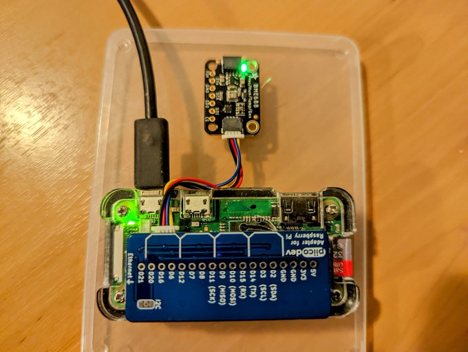

# pi-environment-sensor

This is a WIP using a [raspberry pi zerow](https://www.raspberrypi.com/products/raspberry-pi-zero-w/) and an [adafruit bme688 sensor](https://www.adafruit.com/product/5046) to build a small wireless environment sensor.

# Overview

This is what my development environment looks like at the moment, uses a bit of some double sided tape to secure the parts to the lid of a plastic container. This keeps them all together and avoids wires and such hanging around.

# Prequisites

Before you can build this you need to download the "BSEC 2.x Software" from https://www.bosch-sensortec.com/software-tools/software/bme688-software/#aistudio and extract it into the project folder.

# references

Some of the projects which helped me get started.

* https://github.com/alexh-name/bsec_bme680_linux
* https://github.com/BoschSensortec/BME68x-Sensor-API
* https://github.com/BoschSensortec/Bosch-BSEC2-Library

# License

This code was authored by Mark Wolfe and is licensed under the Apache 2.0 license.